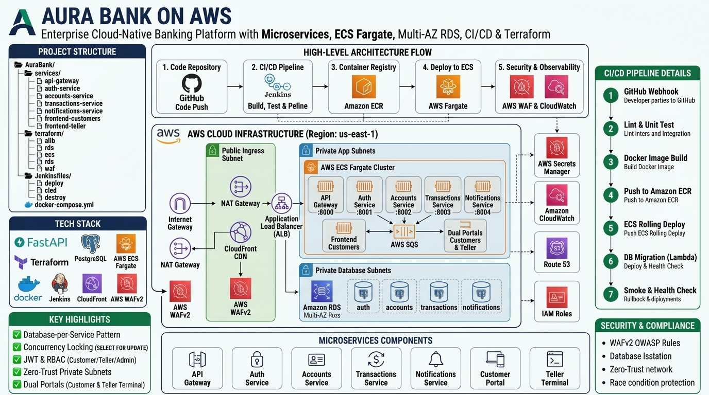

<div align="center">

# 🏦 Aura Bank — Enterprise Cloud-Native Banking Platform


<br/><br/>

> **A production-grade, cloud-native microservices banking platform engineered for high availability, transactional consistency, and enterprise security. Features an API Gateway, database-per-service isolation, an institutional Emerald Wealth customer portal, a branch teller terminal, and automated deployment to AWS ECS Fargate via Terraform & Jenkins.**

</div>

<p align="center">
  
</p>

---

## 📌 Executive Overview

**Aura Bank** is a modern financial platform built from the ground up to demonstrate enterprise microservices patterns and resilient cloud engineering:

- **Strict Service Isolation:** Fully independent microservices communicating strictly via internal REST APIs and asynchronous message queues.
- **Database-per-Service Pattern:** Isolated schemas and dedicated database users within PostgreSQL to enforce domain boundaries and prevent cross-boundary data leakage.
- **Financial Concurrency Safety:** Strict distributed locking and transactional atomicity using PostgreSQL `SELECT ... FOR UPDATE` row locks to guarantee zero double-spending and prevent race conditions.
- **Dual Frontends:**
  - **Customer Digital Banking Portal:** Sleek institutional *Emerald Wealth* design for account management, transfers, bill payments, currency exchange, savings goals, and loan requests.
  - **Branch Teller & Operations Terminal:** High-throughput internal workstation for tellers, supervisors, and system administrators with live audit trails and cashier logs.
- **Dual Deployment Paradigms:**
  - **Local Development:** One-command orchestration via `docker compose up --build`.
  - **AWS Cloud Production:** Full Infrastructure as Code (IaC) with Terraform across private VPC subnets, AWS ECS Fargate, Multi-AZ RDS, Application Load Balancers, CloudFront CDN, and AWS WAFv2.

---

## 🏗️ System Architecture

### 1. Local Development Topology (Docker Compose)

```
                         ┌──────────────────────────────────────────────┐
                         │               CLIENT BROWSER                 │
                         │   frontend-customers    frontend-teller      │
                         │        :8080                 :8081           │
                         └──────────────┬───────────────────────────────┘
                                        │ (HTTP /api/*)
                         ┌──────────────▼───────────────────────────────┐
                         │              API GATEWAY :8000               │
                         │      JWT Validation · Rate Limiting · RBAC   │
                         └──┬───────────┬──────────────┬─────────────┬──┘
                            │           │              │             │
                      auth-service  accounts-svc  txn-service  notif-service
                         :8001        :8002          :8003         :8004
                            │           │              │             │
                         auth_db   accounts_db     txn_db       notif_db
                        (schema)    (schema)      (schema)      (schema)
                            └───────────┴──────┬───────┴─────────────┘
                                               │
                                       PostgreSQL 15 (Docker)
```

### 2. AWS Cloud Production Topology

```
User / Branch Teller
 │
 ▼
Route 53 (DNS)
 │
 ▼
AWS CloudFront (CDN & Edge Caching)
├── app.aurabank.eg    ──► AWS WAFv2 (OWASP Top 10 + Rate Limiting)
└── teller.aurabank.eg ──► AWS WAFv2 (IP Allowlist + Strict Inspection)
 │
 ▼
Application Load Balancer (Public Subnets, SSL Termination)
├── /api/*    ──► Target Group: API Gateway (:8000)
├── /teller/* ──► Target Group: Frontend Teller (:80)
└── /*        ──► Target Group: Frontend Customers (:80)
 │
 ├── AWS ECS Fargate (Private Subnets, awsvpc + AWS Cloud Map Service Discovery)
 │   ├── api-gateway           :8000  (JWT · Rate Limiter · Proxy Engine)
 │   ├── auth-service          :8001
 │   ├── accounts-service      :8002
 │   ├── transactions-service  :8003 ──► AWS SQS Queue
 │   └── notifications-service :8004 ◄── AWS SQS Queue ──► AWS SES (Email) / SNS (SMS)
 │
 └── Amazon RDS PostgreSQL (Isolated Database Subnet, Multi-AZ)
     ├── Schema: auth          (User: auth_user)
     ├── Schema: accounts      (User: accounts_user)
     ├── Schema: transactions  (User: transactions_user)
     └── Schema: notifications (User: notifications_user)
```

---

## 🛠️ Tech Stack Matrix

| Layer | Technologies & Standards |
|---|---|
| **Backend Framework** | Python 3.12 · FastAPI (ASGI) · Uvicorn · Pydantic v2 |
| **Data Layer** | PostgreSQL 15 · psycopg2 Threaded Connection Pool · Connection Pooling |
| **Authentication & RBAC** | JWT (HS256) · Passlib / bcrypt · Role-Based Access Control |
| **Message Broker & Events** | AWS SQS · In-memory / background async queues |
| **Frontend Applications** | HTML5 · Modern Responsive CSS3 (Glassmorphism & Emerald Wealth Theme) · Vanilla JavaScript SPA |
| **Reverse Proxy & Web Server** | Nginx 1.27 Alpine · Security Headers · Dynamic Proxy Pass |
| **Containerization** | Docker · Multi-stage Container Builds · Docker Compose v2 |
| **Cloud Infrastructure (AWS)** | ECS Fargate · RDS PostgreSQL · ALB · CloudFront · WAFv2 · Route 53 · Secrets Manager |
| **Infrastructure as Code (IaC)** | Terraform 1.7+ · S3 Remote State Backend · DynamoDB State Locking |
| **CI/CD Automation** | Jenkins Pipelines (Declarative) · GitHub Webhook Integrations |

---

## 📦 Microservices Breakdown

### 1. `api-gateway` (:8000)
- Single public entry point for all frontend client traffic.
- Validates cryptographic JWT tokens before routing downstream.
- Built-in in-memory rate limiting (60 requests/minute per IP/User, 10 req/min for auth).
- Role-Based Access Control enforcement (`customer`, `teller`, `supervisor`, `admin`).
- Request tracing with unique `X-Request-ID` and latency logging.

### 2. `auth-service` (:8001)
- Customer registration and instant account creation dispatch.
- Customer login with secure password hashing (`bcrypt`, cost factor 12).
- Employee authentication supporting multi-branch teller, supervisor, and administrator roles.
- Dedicated schema: `auth.users`, `auth.employees`, `auth.audit_log`.

### 3. `accounts-service` (:8002)
- Customer bank accounts management and unique account number generator (`AURA-XXXXXXXX`).
- Digital and physical card lifecycle management (Virtual Visa, debit/credit issuance, instant freeze/unfreeze).
- Savings goals tracker with percentage progress calculation.
- Personal loan application submission, review, and status tracking.

### 4. `transactions-service` (:8003)
- Executes peer-to-peer internal transfers between Aura Bank accounts with ACID compliance.
- Row-level database locking (`SELECT ... FOR UPDATE`) prevents concurrent balance exploitation.
- Branch teller operations: cash deposits, cash withdrawals, and bill payments.
- Real-time foreign exchange engine (EGP, USD, EUR, GBP, SAR, AED, KWD).
- Cashier transactions audit ledger (`teller_log`).

### 5. `notifications-service` (:8004)
- Centralized event consumer processing transactional notification alerts.
- In-app notification inbox with read/unread status.
- Integration-ready for AWS SES (Email dispatch) and AWS SNS (SMS alerts).

### 6. `frontend-customers` (:8080)
- Customer-facing Single Page Application (SPA) served via Nginx.
- Emerald Wealth institutional UI aesthetic: subtle dark green gradients, vector SVGs, and real-time interactive widgets.
- Complete financial services: accounts, transfers, statements, cards, exchange, and loans.

### 7. `frontend-teller` (:8081)
- High-efficiency branch workstation and administrative portal.
- Role-scoped interfaces: Teller window, loan approval pipeline for supervisors, and employee management + security audit log for administrators.

---

## 🔒 Security & Resilience Architecture

1. **Zero-Trust Network Model:** Backend microservices and the database operate inside private subnets without public IPs. They can only be reached through the API Gateway.
2. **Database-per-Service:** Schemas (`auth`, `accounts`, `transactions`, `notifications`) have distinct credentials; no service has database credentials or permissions outside its domain.
3. **Transaction Atomicity & Race Prevention:** Every financial movement executes inside isolated PostgreSQL transactions with explicit row-level locks:
   ```sql
   SELECT balance FROM accounts.accounts WHERE id = $1 FOR UPDATE;
   ```
4. **AWS WAFv2 Shielding:**
   - **Customer Portal:** Protected by AWS Managed Rules (OWASP Top 10, Common Vulnerabilities, Rate Limiting).
   - **Teller Portal:** Protected by IP Allowlisting to restrict branch terminal access exclusively to trusted corporate CIDR ranges.

---

## 🚀 Quick Start — Local Development

### Prerequisites
- [Docker Desktop](https://www.docker.com/products/docker-desktop/) (v20.10+)
- [Docker Compose](https://docs.docker.com/compose/) (v2.0+)

### Launching the System

```bash
# 1. Clone the repository
git clone https://github.com/rafat-74/aurabank.git
cd aurabank

# 2. Start all microservices, databases, and frontends
docker compose up --build
```

### Access URLs

| Application / Service | URL | Description |
|---|---|---|
| **Customer Banking Portal** | [http://localhost:8080](http://localhost:8080) | Retail & private wealth client portal |
| **Teller & Branch Portal** | [http://localhost:8081](http://localhost:8081) | Internal employee & admin terminal |
| **API Gateway** | [http://localhost:8000](http://localhost:8000) | Central REST Gateway |
| **Health Check Endpoint** | [http://localhost:8000/health](http://localhost:8000/health) | Live service cluster status |

---

## 🔑 Demo Credentials

### Customer Accounts
*You can also create a brand new account directly from the registration page.*

| Full Name | Email Address | Password | Account Number | Initial Balance |
|---|---|---|---|---|
| **Rafat Ashraf** | `demo@aurabank.eg` | `demo123` | `AURA-DEMO0001` | 125,750.50 EGP |
| **Nour Ali** | `nour.ali@gmail.com` | `nour123` | `AURA-ABC12345` | 22,000.00 EGP |
| **Tamer Hassan** | `tamer.h@outlook.com` | `tamer456` | `AURA-BIZ77890` | 480,000.00 EGP |

### Employee & Administrative Accounts
*Quick-fill buttons are available on the Teller login page for one-click access.*

| Username | Password | Role | Assigned Branch | Access Level |
|---|---|---|---|---|
| `Rafat Ashraf K` | `teller123` | **Teller** | Cairo Branch | Cash deposits, withdrawals, transfers, account lookup |
| `s.ahmed` | `teller456` | **Supervisor** | Giza Branch | Loan approval / rejection, high-value transfer oversight |
| `k.abdallah` | `admin789` | **Admin** | Central Operations | Employee management, full audit logs, branch monitoring |

---

## ☁️ Cloud Deployment — AWS Infrastructure

The repository includes complete production Terraform modules under `terraform/` targeting AWS:

```bash
# 1. Initialize remote S3 backend state & DynamoDB locking
./terraform/scripts/bootstrap_state.sh dev us-east-1

# 2. Plan and provision cloud infrastructure
cd terraform/envs/dev
terraform init
terraform apply -var-file=terraform.tfvars

# 3. Build & push container images to AWS ECR
./terraform/scripts/push_images.sh dev us-east-1 <AWS_ACCOUNT_ID> v1.0.0

# 4. Initialize database schemas on RDS via Lambda hook
aws lambda invoke --function-name aurabank-dev-db-init --region us-east-1 /tmp/out.json
```

---

## 📁 Repository Structure

```
AuraBank/
├── docker-compose.yml              # Local multi-service orchestration
├── .gitignore                      # Git exclusion rules
├── README.md                       # Main architecture & overview document
├── README.backend.md               # In-depth microservices backend documentation
├── README.frontend.md              # Frontend architecture & UI theme details
├── README_devops.md                # DevOps, Docker, and CI/CD pipelines guide
├── INFRASTRUCTURE-on-AWS.md        # Detailed AWS architectural reference
│
├── screenshots/                    # Architecture diagrams, UI screenshots & DevOps proofs
│
├── services/
│   ├── api-gateway/                # FastAPI Gateway (:8000)
│   ├── auth-service/               # Authentication & User Management (:8001)
│   ├── accounts-service/           # Account balances, cards, loans (:8002)
│   ├── transactions-service/       # Transfers, cashier ledger (:8003)
│   ├── notifications-service/      # Notifications worker (:8004)
│   ├── frontend-customers/         # Customer SPA on Nginx (:8080)
│   └── frontend-teller/            # Teller & Admin SPA on Nginx (:8081)
│
├── scripts/
│   └── init-schemas.sql           # Database schema & role initialization
│
├── Jenkinsfiles/                   # Automated CI/CD pipelines
│   ├── Jenkinsfile.deploy          # Full AWS deployment from scratch
│   ├── Jenkinsfile.cicd            # Delta CI/CD triggered on code push
│   └── Jenkinsfile.destroy         # Cost-saving infrastructure teardown
│
└── terraform/                      # Infrastructure as Code (IaC)
    ├── modules/                    # Reusable modules (VPC, ALB, ECS, RDS, etc.)
    ├── envs/dev/                   # Dev environment config (Fargate Spot)
    ├── envs/prod/                  # Production config (Multi-AZ, HA)
    └── scripts/                    # Deployment & migration automation
```

---

## 📜 License

This project is licensed under the MIT License — feel free to explore, learn from it, or use it for your portfolio.

<div align="center">
  <sub>Developed by <b>Rafat Ashraf</b> · Cloud & DevOps Engineer</sub>
</div>
